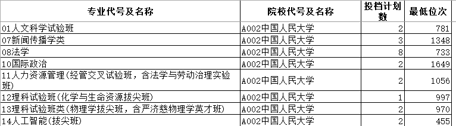
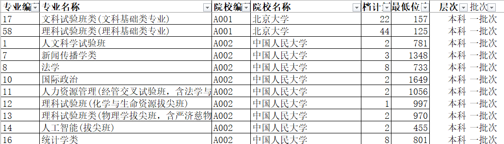
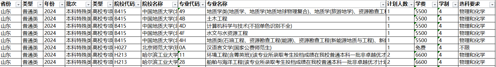
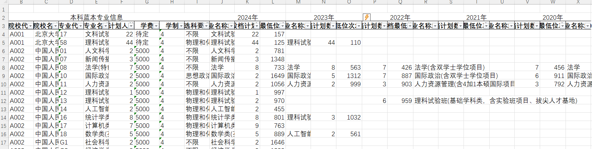
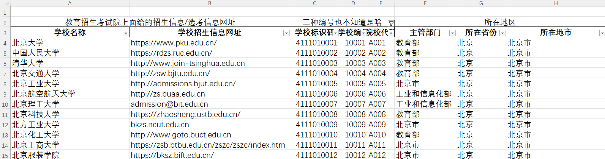
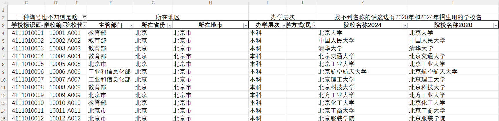
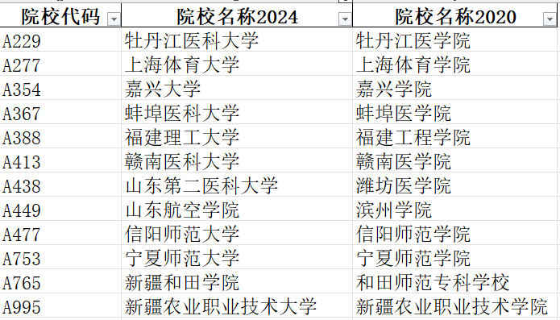
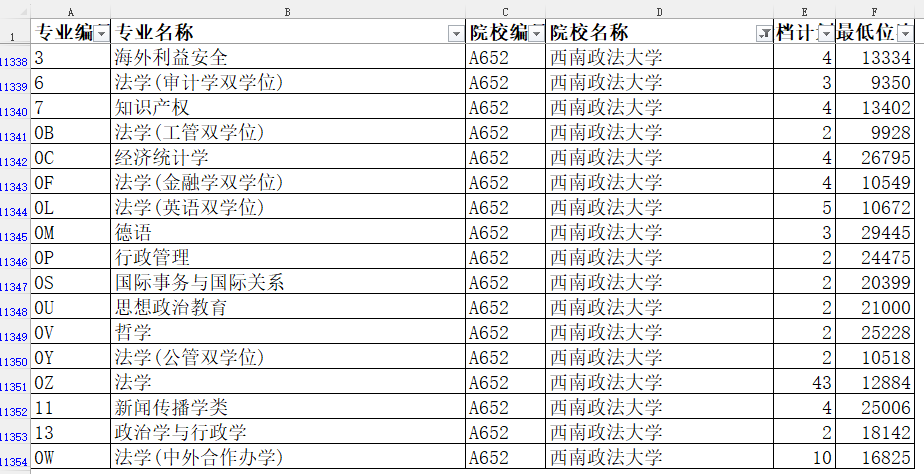
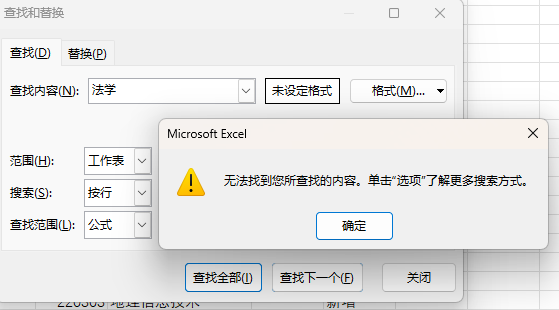
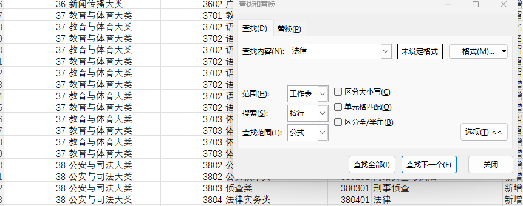

[TOC]

# 概要
主要包括了自2020年新高考改革后山东省高考志愿相关信息，包括招生录取计划和各个批次志愿录取情况。数据使用python进行了简单的处理，最终主要以xlsx表格形式展现出来。招生计划数据以本科为主，2024年包括专科数据。志愿录取数据以及一分一段表等均来自于招生考试院，录取计划数据则来自于志愿报考本科绿本&专科蓝本的电子版，**主要由于绿本蓝本数据不能保证完全准确，故仅供参考**  。  
而高考是一个非常复杂的整体，在没有全局掌握的情况下难以进行整体分析（比如我自己），诸如高考政策、院校名称和专业名称的变化等都使得较为完备的数据分析变得极为困难，故本分析会尽可能保留原始数据以供参考和校对，防止因为错误数据而耽误真正的高考报名。
为了方便下载等，后续数据会加入网盘中，如果不用gitee也能看一下。
各个文件夹内容  

| 文件夹                           | 内容                                                                                                    |
| -------------------------------- | ------------------------------------------------------------------------------------------------------- |
| 报考要求信息                     | 主要包括各个高校招生等简要信息，少量专业信息以及选考限制|
| 山东省各批次志愿录取数据         | **2020-2023间各个志愿批次招生考试网站源数据** ，主要包括院校和专业名称，录取人数和位次                  |
| 山东省各批次志愿录取数据年份合并 | **2020-2023间各个志愿批次信息按照批次直接拼接**主要包括院校和专业名称，录取人数和位次，批次和办学层次等 |
| 山东省招生计划数据               | 即高考志愿绿皮书和蓝皮书以本科为主仅2024年有专科数据                                                    |
| 山东省分数一分一段表             | 2020-2024年的夏季高考一分一段表                                                                         |
| 山东省本专科招生变化         | 2020-2024年按照高校和专业编号进行招生人数变化对比                                                                         |
| 主文件夹根目录下                 | 代码文件及对比文件，主要为每年之间计划人数、录取名称等对比                                              |
# 关于其他省市
由于山东省的春季高科和夏季高考各个批次的投档录取情况均**明确公布**于[山东省教育招生考试院](https://www.sdzk.cn/)以及[山东省教育厅](http://edu.shandong.gov.cn).诸如专业各项变化也会公布在[教育部网站公布](http://www.moe.gov.cn/s78/A07/zcs_ztzl/2017_zt06/17zt06_bznr/zhijiao/)和[阳光高考](https://gaokao.chsi.com.cn/)。
如果其他省级行政区也有明确的高考志愿录取信息则可以同样按照相似流程进行.报考要求信息文件夹部分对于外省也有一定参考价值，比如各种名称的变化.后续也会进行可视化以及文本分析，同样对于整体趋势有一定的帮助。
例如本人现在所在的湖北省，高考相关数据公示较少，故可进行的分析较少。而河南和山东相似均公布大量数据，后续可以进行类似分析，会放在单独的仓库中。

# 部分详细信息
文件信息，给出表格截图示例
## 山东省各批次志愿录取数据&&山东省各批次志愿录取数据年份合并
主要为从山东省教育招生考试院中下载并初步处理的各个录取批次的数据,位于[山东省教育招生考试院的夏季高考板块](https://www.sdzk.cn/NewsList.aspx?BCID=2)，包括从2020-2024年每年一二三批次的数据以及春季高考等相关信息.对于山东而言，一般一批次录取本科批次，二批次主要为专科批次以及未报满的一批次志愿，三批次则主要为补录。
这里整理的数据**如果第三批次数据过少则不单独呈现，忽略或是直接合并到一次处理的文件中**，以及初步按照年份合并每一个录取批次为一个文件的一次处理文件。即*xxxx一二三批次合并*。  
由于山东省自2020年进行高考改革后采用赋分制度等原因，**故往年录取分数参考意义不大**，在2021年开始各个录取批次原始文件不在提供录取分数作为参考，不过可以较为容易的从一分一段表中得知。在原始文件中主要提供**专业代号及名称，院校代号及名称，投档计划数，投档最低位次**4个主要数据，初步的数据处理主要在于改变并统一文件格式，规范表头内容。
一次处理文件为简单首位相连纵向合并每一年三个批次的数据，并且拆分合并在一起的编号和名称*专业代号及名称，院校代号及名称->专业代号，专业名称，院校代号院校名称*，例如下面的表格。 并对于每一条志愿录取数据增加其所在录取批次，以区分不同批次可能的冲突。
原始数据

一次处理数据

## 山东省招生计划数据
即本科绿本和专科蓝本数据，专科数据仅有2024年。同样在初步处理中尽可能规范数据格式便于后续处理。尽管已经非常准确，但是还是由于并非官方数据，这部分数据**置信度未知，谨慎参考**  
**置信度未知，谨慎参考**  
**置信度未知，谨慎参考**  

## 山东省分数一分一段表
山东省教育招生考试院发布的一分一段表，由于采用赋分制，故一分一段表参考意义不会太大。

## 山东省本专科招生变化
即根目录下面的*本科录取年际变化.xlsx*和*专科录取年际变化.xlsx*分别对于本科和专科从2020年开始以特定学校-专业为单位进行录取数据年际变化对比。数据合并基于两位专业代码和四位高校代码，故年份越接近2024年其数据的重合度越高，而由于专业代号可能随着专业而变化故部分数据可能存在错误。  
数据匹配使用**尽力而为**的合并方法。合并基于专业二位代码或者专业名称全称，二者其一完全符合即加入到表格中，故存在部分错位等尤其以专业代码为主要。这里保留了原始的专业名称全称文本以供校对，尤其是外省高校招生计划不定故该现象较为明显，在表格中对于同一个专业除非二者合并的结果完全相同，否则会同时有两条分别以名称和代码为基准的数据进行参考。 
如果excel能力较强可以基于合并完成的一二三批次数据使用数据透视表进行查询。

## 高考新闻发布会（待加入）
山东省教育厅对于每一年的夏季高考都有三次高考新闻发布会，在[山东省教育厅的新闻发布会板块](http://edu.shandong.gov.cn/col/col11973/index.html)有详细公布。一般来说第一次高考新闻发布会位于高考前，主要内容为**高考组织实施情况及有关提醒事项**。第二次高考新闻发布会位于高考结束后阅卷阶段，主要内容为**高考评卷工作、分数线划定情况及录取工作安排等**。第三次高考新闻发布会位于报考志愿前，主要内容为**录取工作情况、录取工作措施、录取有关事项提醒等**。    

## 报考要求信息
主要为整理的一部分志愿报考相关的信息，比如高校招生办网址，高校名称变化等
高校信息同样整理自山东省教育招生考试院  

虽然上面的高校信息包含了高校名称的变化，但是仍然有单独的表格整理了名称变化的高校  

# 分析流程&数据输出
1. 数据清洗入库
从教育招生考试院以及其他高考相关信息中直接下载完成并进行数据清洗后直接入库的初步输入，进行了初步的数据划分、文件名称和表头格式统一等简单分析，并以电子表格形式呈现，尽可能使用扁平表避免诸如单元格合并等操作。  
包括已经打包为文件夹的**山东省分数一分一段表**、**山东省各批次志愿录取数据**、**山东省招生计划数据（蓝本绿本）**  
2. 数据合并分析
基于完成数据清洗入库后进行简单合并分析，主要按照如年份等表示对于数据进行初步的合并，可以基于此对于自山东省新高考改革以来整体数据的简单对比分析，可以用于帮助志愿报考。
包括打包为文件夹的**报考要求信息**，**各批次志愿录取数据年份合并**和**山东省本专科招生年际变化**
山东省本专科招生年际变化由于**专业名称以及专业代号**存在变化，故部分数据存在对齐不准确的情况。目前有三种可行的合并方法(除了手动)，即使用专业名称或者是院校自己的专业编号和国家给出的三级专业编号，首先专业名称或者是院校自己的专业编号存在变化存在不准确，正在寻找解决方法，例如在西南政法大学中有多个不同的法学招生类别。其次即使是专业名称首部也不完全是标准的国家标准中专业编号，例如法**学**并不是标准的专业名称(仅有"法律")

3. 额外文本信息整理获取
在完成了初步整理后，对于此类题目如果需要进一步进行分析，更多的需要去找寻其他的信息源以获取更多的数据，比如文本型数据来源中找寻其他数据，如高考新闻发布会等可以初步进行分析

[录取数据年际变化分析](/录取数据年际变化分析.md)

# 可视化图表
使用pyecharts可视化部分数据以便于后续分析并且可以进行交互，保存在本地网页文件中，主要因为有时间轴图表不方便直接导出离线图片。首次加载需要消耗较长时间且需要联网。建议使用火狐或者Edge等浏览器
[可视化图表本地网页](可视化图表.html)

# 更新计划
对于年际变化数据合并准备采用汉字专业名称和专业代码两个部分分别合并以尽可能提高准确度。  
- 已经完成替代，但是仍然存在部分不准确，专业名称或者专业代码其一**完全**匹配则加入表格
进行文本层次分析  
- 由于分词需要再次调整暂时搁置
对于专业和录取人数进行数值分析，如选出最热门的前n个专业
- 在图表中已经给出了人数最多的专业和人数最少的专业，分别以柱状图和词云图给出。按照年份使用时间轴图表呈现
为了便于直接在网页端查看，部分文件同时提供xlsx和csv版本
- 部分图表已经给出csv文件
